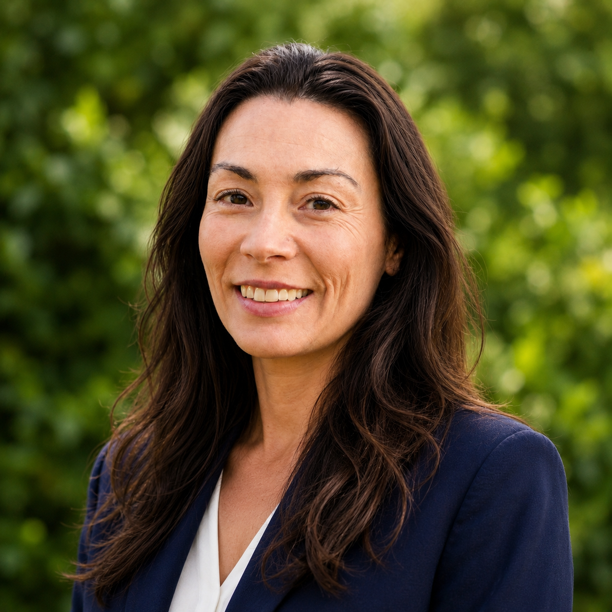
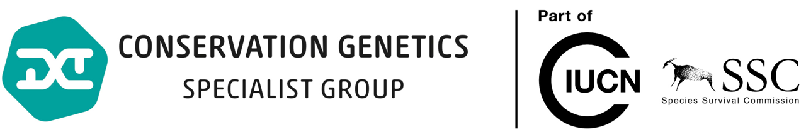
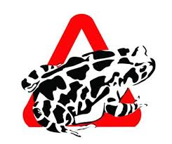
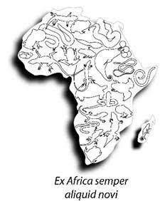
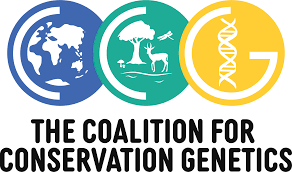
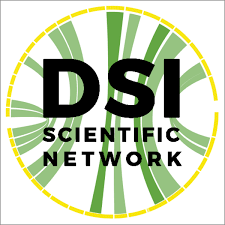
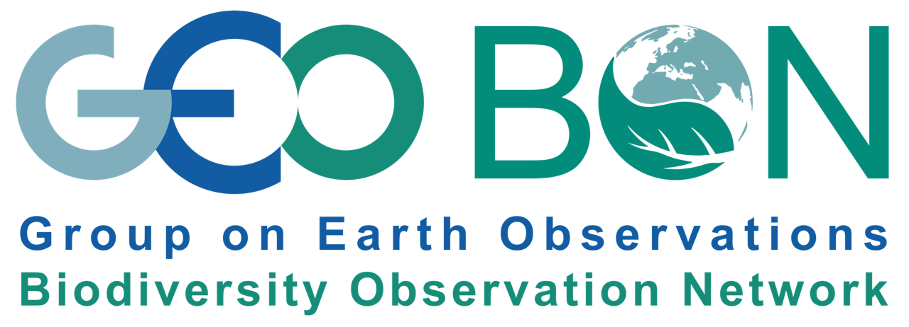
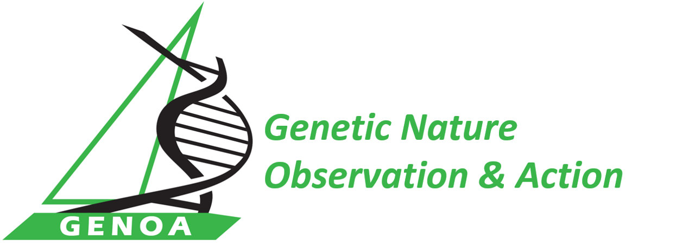

::::: hero
::: hero-text
# Jessica M. da Silva, PhD

I am a conservation geneticist working at the intersection of evolutionary biology, genetic diversity monitoring, and science-policy engagement to support evidence-based biodiversity conservation.

My work focuses on translating genetic and genomic knowledge into practical tools for biodiversity assessment, conservation planning, and national and international reporting.

[Research](research.qmd){.btn .btn-primary} [Publications](publications.qmd){.btn .btn-outline-primary}
:::

::: hero-image

:::
:::::

## Research themes

:::::: grid
::: {.g-col-12 .g-col-md-4 .research-card}
### Conservation genomics

Using genomic tools to understand population structure, connectivity, adaptation, and conservation risk.
:::

::: {.g-col-12 .g-col-md-4 .research-card}
### Evolutionary diversity

Applying phylogenetic diversity to support conservation prioritisation.
:::

::: {.g-col-12 .g-col-md-4 .research-card}
### Genetic diversity indicators

Developing and applying indicators that support national and global biodiversity reporting.
:::
::::::

## Leadership Roles

::: role
{width="140px"}

**Principal Scientist**\
[South African National Biodiversity Institute](https://www.sanbi.org/) *Genetic Lead, National Biodiversity Assessment*
:::

::: role
[{width="240px"}](https://consgen.org/)

**Deputy Chair**\
IUCN SSC Conservation Genetics Specialist Group
:::

::: role
[{width="90px"}](https://www.westernleopardtoad.org/)

**Chair**\
Western Leopard Toad Conservation Committee
:::

::: role
{width="70px"}

**Editor-in-Chief**\
[African Journal of Herpetology](https://www.tandfonline.com/journals/ther20)

**Associate Editor**\
[Conservation Science and Practice](https://conbio.onlinelibrary.wiley.com/journal/25784854)\
[African Biodiversity and Conservation](https://www.abcjournal.org/index.php/abc)
:::

## Professional Memberships and Networks

::: network-bar
[{width="100px"}](https://www.coalitionforconservationgenetics.org/)

[{height="60px"}](https://dsi-scientific-network.org)

[{height="60px"}](https://geobon.org/ebvs/working-groups/genetic-composition/) **Genetic Composition WG**

[{height="60px"}](https://genoageneticdiversity.eu/)

[{height="60px"}](https://www.congenafrica.com/)
:::

*Member of international initiatives supporting conservation genetics, biodiversity monitoring, genetic diversity assessment, and digital sequence information governance.*
