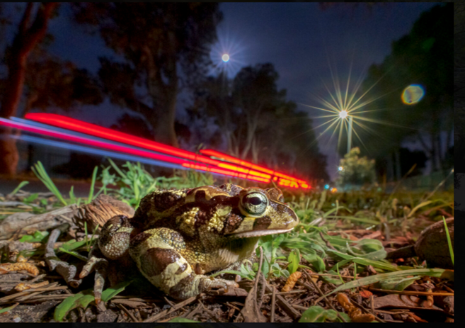
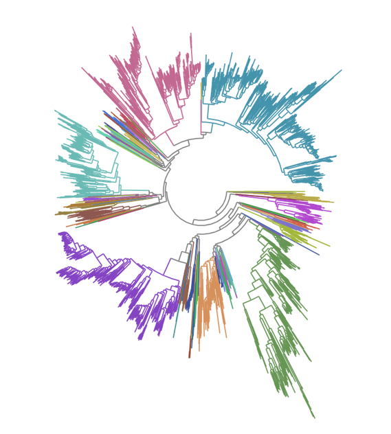
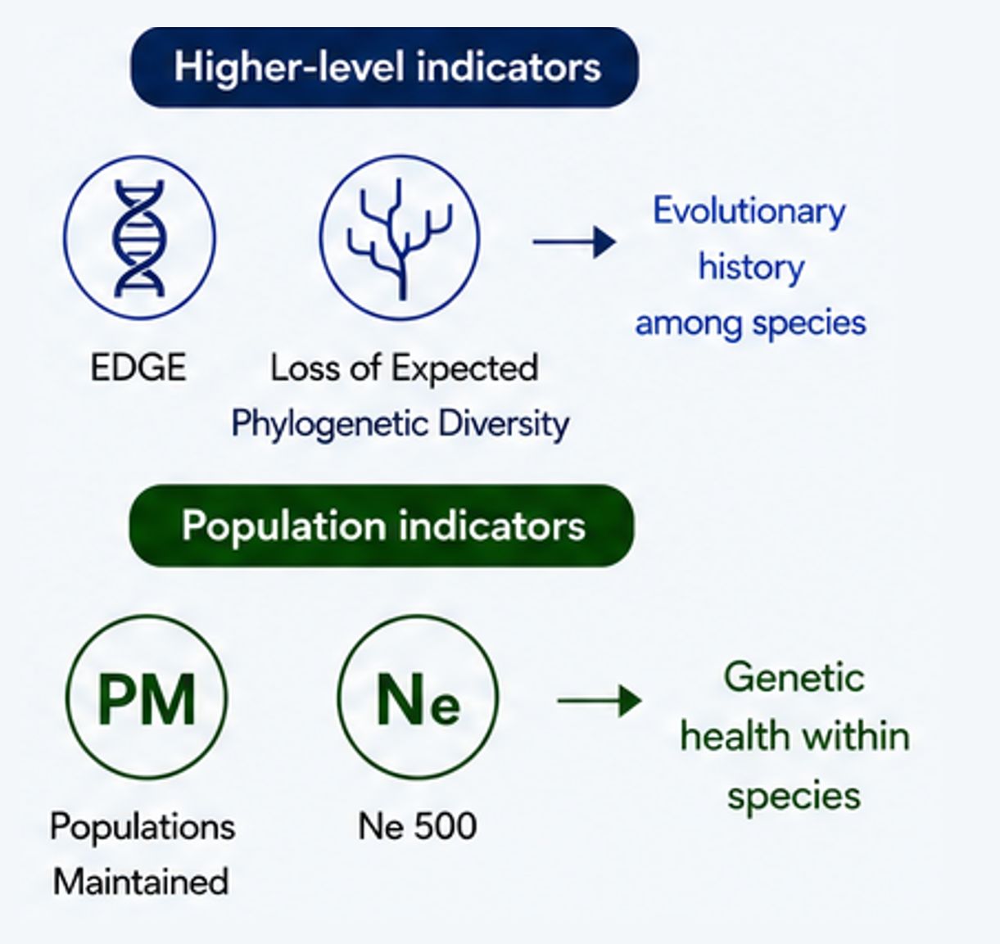
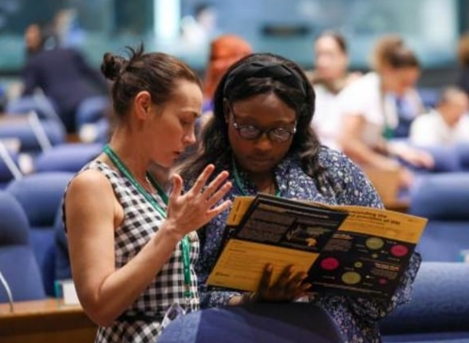

My research focuses on understanding, monitoring, and conserving genetic diversity. Current work spans four interconnected themes: [conservation genomics], [evolutionary diversity], and [genetic diversity indicators], and the [science–policy interface](#sciencepolicy-interface).

## Conservation Genomics

::::: research-row
::: research-text
Conservation genomics provides powerful tools for understanding population structure, connectivity, adaptive variation, and extinction risk. My research applies genomic approaches to support the conservation and management of threatened species, with a particular focus on southern African biodiversity.

Current and recent projects include:

-   Population genomics of threatened Karoo dwarf tortoises (*Chersobius boulengeri* and *C. signatus*)
-   Landscape genomics of *Hyperolius pickersgilli*
-   Genetic monitoring of the Endangered Western Leopard Toad (*Scleroprys pantherina*)
:::

::: research-image

:::
:::::

## Evolutionary Diversity

::::: {.research-row .image-left}
::: research-image

:::

::: research-text
Biodiversity conservation aims not only to preserve species, but also the evolutionary history they represent. My work investigates patterns of phylogenetic diversity and evolutionary distinctiveness to identify conservation priorities and improve biodiversity assessments.

Current areas of research include:

-   Phylogenetic diversity assessments for South African taxa
:::
:::::

## Genetic Diversity Indicators

::::: research-row
::: research-text
Genetic diversity is increasingly recognised as a fundamental component of biodiversity. A major focus of my research is the development, testing, and implementation of indicators that allow genetic diversity to be monitored and reported at national and international scales.

Current work includes:

-   National-scale, complete taxonomic assessments of genetic diversity indicators
-   Integration of indicators into biodiversity monitoring programmes
-   Applications within IUCN Red List and Green Status assessments
-   Development of practical frameworks for genetic diversity monitoring
:::

::: research-image

:::
:::::

## Science–Policy Interface {#sciencepolicy-interface}

::::: {.research-row .image-left}
::: research-image

:::

::: research-text
A defining feature of my research programme is the translation of scientific knowledge into conservation policy and practice. I work closely with national and international initiatives to improve the incorporation of genetic diversity and evolutionary processes into biodiversity assessment, monitoring, and decision-making.

Examples include:

-   [South Africa's National Biodiversity Assessments](https://nba.sanbi.org.za/)
-   Convention on Biological Diversity (CBD) reporting and implementation
-   IUCN Red List and Green Status initiatives
-   Development of global standards and monitoring frameworks
:::
:::::
