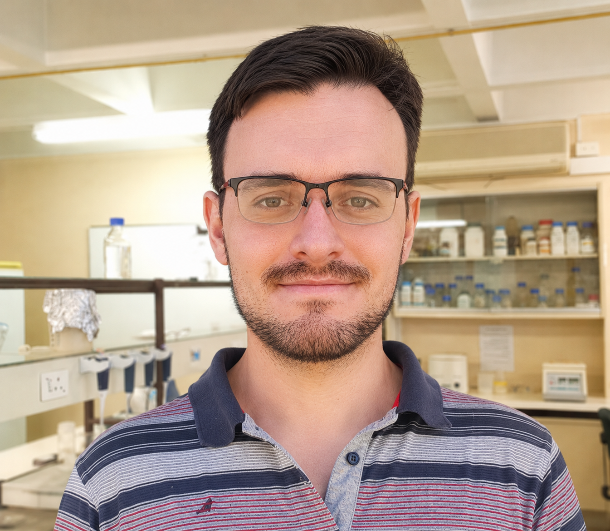
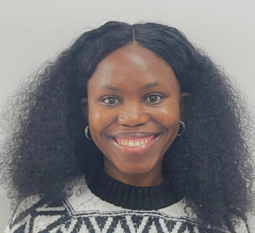

## Current Members

### Postdoctoral Researchers

#### Dr Jody Taft

Using population genomics to investigate adaptive genetic diversity and climate resilience in South Africa's threatened Karoo dwarf tortoises (*Chersobius boulengeri* and *C. signatus*), supporting evidence-based conservation management and monitoring.

::: {.team-member}

{.team-photo width="150" height="150"}

::: {.team-info}

#### Dr Frederik van Heerden

Quantifying phylogenetic diversity, evolutionary distinctiveness (EDGE), and expected phylogenetic diversity loss in South African mammals to support biodiversity assessment, conservation prioritisation, and national monitoring.

:::

:::

### Postgraduate Students

#### Kyle Smith

PhD candidate (Cardiff University)

Using population genomics, environmental DNA (eDNA), and ecological network analyses to investigate connectivity, community interactions, and conservation management of the Endangered Pickersgill's Reed Frog (*Hyperolius pickersgilli*).

::: {.team-member}

{.team-photo width="150" height="150"}

::: {.team-info}

#### Petra Yawanu

MSc candidate (University of Namibia)

Assessing the current status and application of conservation genetics in Namibia, and quantifying national genetic diversity indicators for biodiversity monitoring.

:::

:::

### Interns

::: {.team-member}

{.team-photo}

::: {.team-info}

#### Ayandisa Zongo

Joan Wrench Intern

:::

:::

## Alumni

### Postgraduate Students

Charlotte Combrink (MSc, Stellenbosch University), 2025

Matthew Adair (Msc, University of Johannesburg), 2023

Keith Dube (Msc, University of Johannesburg), 2022

### Interns

Jade Simoen, 2025-2026

Future Machate, 2025-2026

Masivuye Bulube, 2024
